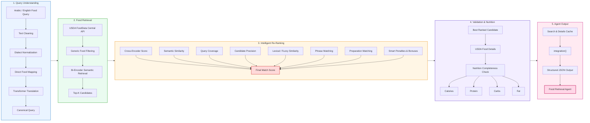

# NutriAgent AI

NutriAgent AI is an AI-powered nutrition and food retrieval agent that understands Arabic and English food queries, searches USDA FoodData Central, ranks the most relevant food matches, and returns accurate nutritional information.

The system combines NLP, semantic search, Cross-Encoder re-ranking, food-query normalization, and USDA nutrition data retrieval in a single intelligent pipeline.

---

## Features

- Arabic and English food query support
- Egyptian Arabic food normalization
- Arabic-to-English Transformer translation
- Smart food-name mapping
- USDA FoodData Central API integration
- Semantic food retrieval using Sentence Transformers
- Cross-Encoder re-ranking
- Lexical and fuzzy matching
- Cooking-method detection
- Composite-food and processed-food penalties
- Automatic selection of the best food match
- Calories and macronutrient extraction
- Complete integration pipeline through a single agent function

---

## Technologies

- Python
- NLP
- Hugging Face Transformers
- Sentence Transformers
- USDA FoodData Central API
- Pandas
- PyTorch

## System Workflow

```text
User Food Query
      ↓
Input Validation
      ↓
Food Query Normalization
      ↓
Arabic-English Translation / Mapping
      ↓
USDA Food Search
      ↓
Semantic Retrieval
      ↓
Cross-Encoder Re-ranking
      ↓
Smart Matching & Validation
      ↓
Nutrition Data Extraction
      ↓
Final Agent Response




---

## Example

Input:

```python
integration("رز أبيض")

---
Output:
 Normalized Query: white rice
 Best Match: Rice, white, cooked
 Calories: 130 kcal
 Protein: 2.54 g
 Carbs: 29 g
 Fat: 0.37 g
